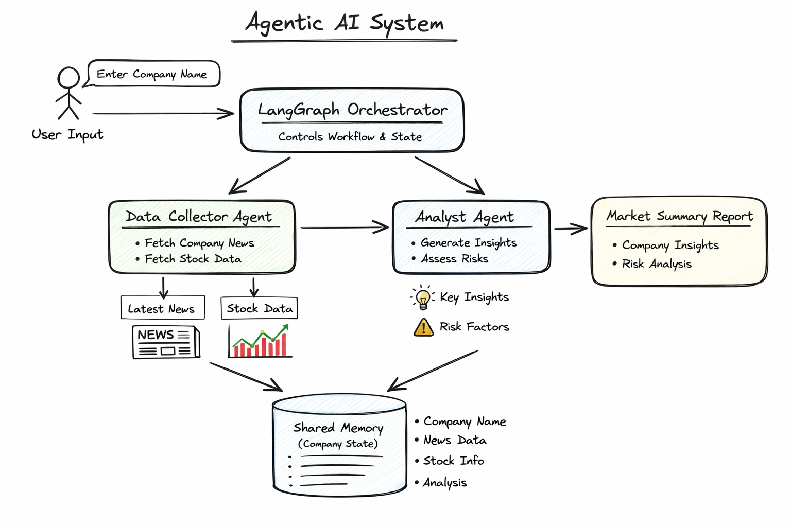

# 🧠 Agentic Company Intelligence System (LangGraph)

A **multi-agent AI system** built using **LangGraph** that demonstrates agent collaboration, shared memory, and orchestration to generate a **company intelligence report** from news and stock data.

This project is designed to showcase **agentic workflows**, **state management**, and **clean system architecture** for real-world AI applications.

---

## 📌 Problem Statement

Design an **Agentic AI System** with two or more collaborating agents to perform a multi-step task.

### Chosen Use Case
**Company Intelligence System**
- Collects company-related news and stock data
- Analyzes the data to generate insights and risk factors

---

## 🎯 Objective

- Demonstrate understanding of **multi-agent systems**
- Implement **agent orchestration using LangGraph**
- Maintain **shared context and memory** between agents
- Follow **clean, modular, production-ready design**

---

## 🏗️ System Architecture

### High-Level Flow

1. User provides a company name
2. Orchestrator (LangGraph) controls execution flow
3. Data Collector Agent fetches raw data
4. Analyst Agent generates insights and risks
5. Final intelligence report is returned

---

## 🖼️ Visual Architecture Diagram

 This diagram represents the complete agent workflow and shared memory.




---

## 🤖 Agents Overview

### 1️⃣ Data Collector Agent
**Responsibility:**
- Fetch company news
- Fetch stock performance data

**Characteristics:**
- No reasoning or analysis
- Uses pluggable data sources

---

### 2️⃣ Analyst Agent
**Responsibility:**
- Analyze collected data
- Generate insights and risk factors

**Characteristics:**
- Reasoning-only agent
- Consumes shared state

---

### 3️⃣ Orchestrator (LangGraph)
**Responsibility:**
- Controls agent execution order
- Maintains shared memory (state)
- Ensures deterministic workflow

---

## 🧠 Shared Memory (State)

All agents operate on a **shared typed state**:

```python
class CompanyState(TypedDict):
    company_name: str
    news: List[str]
    stock_data: Dict
    analysis: str
```

## ▶️ How to Run
1️⃣ Install Dependencies
```
pip install -r requirements.txt
```

2️⃣ Run the System

### python main.py

📤 Output

```
📊 Company Intelligence Report

Key Insights for {company_name}:
- Strong innovation momentum driven by recent product launches
- Positive market sentiment reflected in stock movement

Stock Overview:
- Current Price: 320
- Weekly Change: +4.5%
- Market Cap: 1.2T USD

Risks:
- High valuation may cause short-term volatility
- Competitive pressure in AI-driven markets

```